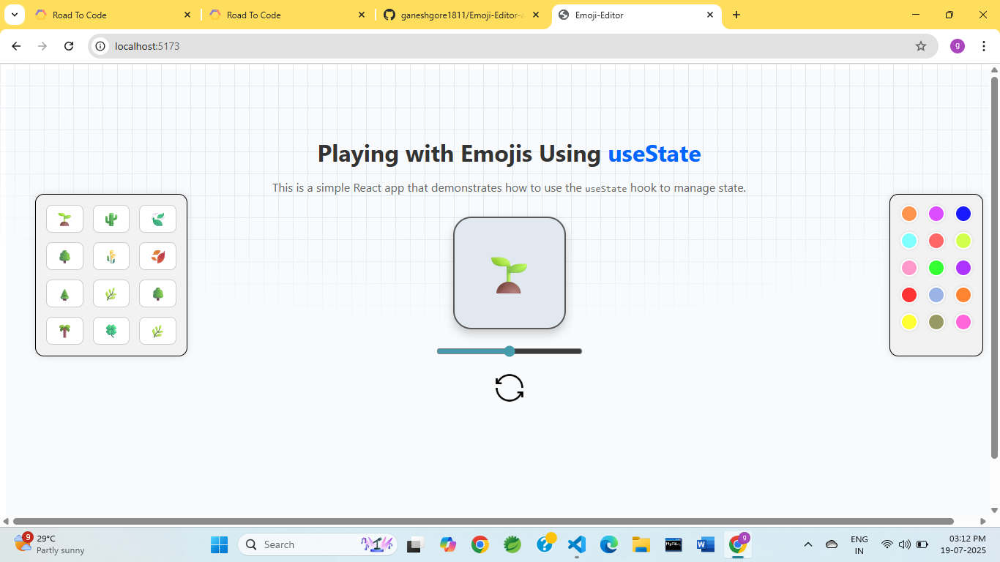

# 🌟 Emoji Editor – React App using useState

This is a fun and interactive **React project** that demonstrates how to use the `useState` hook to dynamically update emojis, font size, rotation, and background color. It’s a perfect hands-on example for beginners learning React.

---

## 📸 Demo Features

- 🌱 Add multiple emojis
- 🎚️ Adjust emoji size using a slider
- 🔄 Rotate emoji by 45° on each click
- 🎨 Change background color using color pickers
- 🧹 Clear all emojis
- 📋 Copy emojis to clipboard
- 🖱️ Hover and animated emoji styling

---

## 🧠 Concepts Covered

- React `useState` hook
- Component communication via props
- Conditional inline styling
- Basic CSS styling and transitions
- Event handling (onClick, onChange)
- Reusability with custom components

